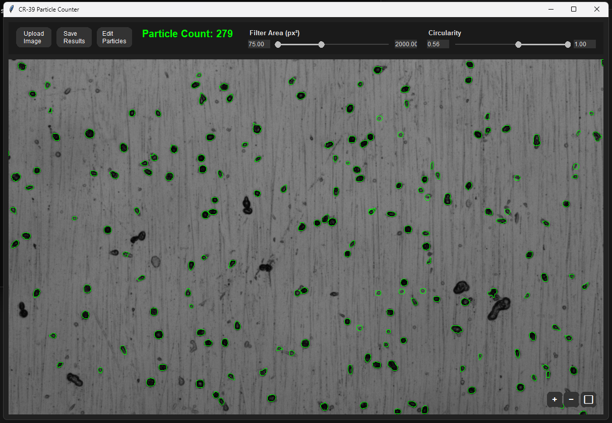

# CR-39 Particle Counter



## Features
- Upload CR-39 images (PNG, JPG, JPEG, BMP, TIF).
- Auto-detect particle tracks using OpenCV.
- Filter by particle area (px²) and circularity (0.0-1.0).
- Zoom (mouse wheel or Ctrl+/-) and pan (drag mouse).
- Edit mode: Click to add/remove particles.
- Live particle count display.
- Save results to text file.
- Cross-platform (Windows, macOS, Linux).

## Installation

### Windows
1. **Install Python 3.12+**:
   ```
   winget install Python.Python.3.12
   ```
   Or download from [python.org](https://www.python.org/downloads/), run installer, and check "Add Python to PATH".

2. **Install Dependencies**:
   ```
   pip install pillow opencv-python numpy
   ```

3. **Clone Repository**:
   ```
   git clone https://github.com/Garud218/cr39_particle_counter.git
   cd cr39_particle_counter
   ```

### macOS
1. **Install Homebrew** (if not installed):
   ```
   /bin/bash -c "$(curl -fsSL https://raw.githubusercontent.com/Homebrew/install/HEAD/install.sh)"
   ```

2. **Install Python 3.12+**:
   ```
   brew install python@3.12
   ```

3. **Install Dependencies**:
   ```
   pip install pillow opencv-python numpy
   ```

4. **Clone Repository**:
   ```
   git clone https://github.com/Garud218/cr39_particle_counter.git
   cd cr39_particle_counter
   ```

### Linux (Ubuntu/Debian)
1. **Install Python 3.12+ and Tkinter**:
   ```
   sudo apt update
   sudo apt install python3.12 python3-pip python3-tk git -y
   ```

2. **Install Dependencies**:
   ```
   pip install pillow opencv-python numpy
   ```

3. **Clone Repository**:
   ```
   git clone https://github.com/Garud218/cr39_particle_counter.git
   cd cr39_particle_counter
   ```

**Other Linux Distros** (e.g., Fedora):
- Replace `apt` with `dnf`:
  ```
  sudo dnf install python3 python3-pip python3-tkinter git -y
  ```
- Then follow steps 2 and 3 above.

## Usage

1. **Run the App**:
   ```
   python microscopic_pc.py
   ```

2. **Upload Image**:
   - Click "Upload Image".
   - Select CR-39 image file.

3. **Adjust Filters**:
   - Use sliders or input fields for area (default: 75-2000 px²) and circularity (0.65-1.0).
   - Changes update count and green contours live.

4. **Navigate Image**:
   - Zoom: Mouse wheel or Ctrl+/-.
   - Pan: Drag with left/middle mouse.
   - Fit: Click '⬜' button.

5. **Edit Particles**:
   - Click "Edit Particles" to toggle mode.
   - Remove: Click green contour.
   - Add: Click empty area for new circle.
   - Toggle off to exit.

6. **Save Results**:
   - Click "Save Results".
   - Choose filename for text output.
